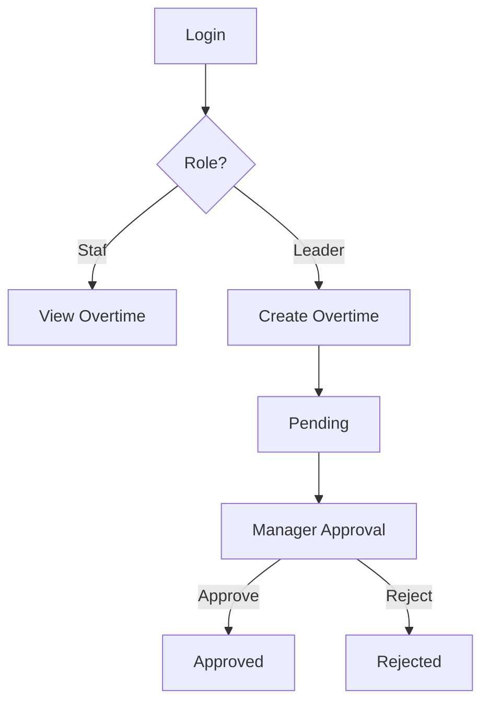
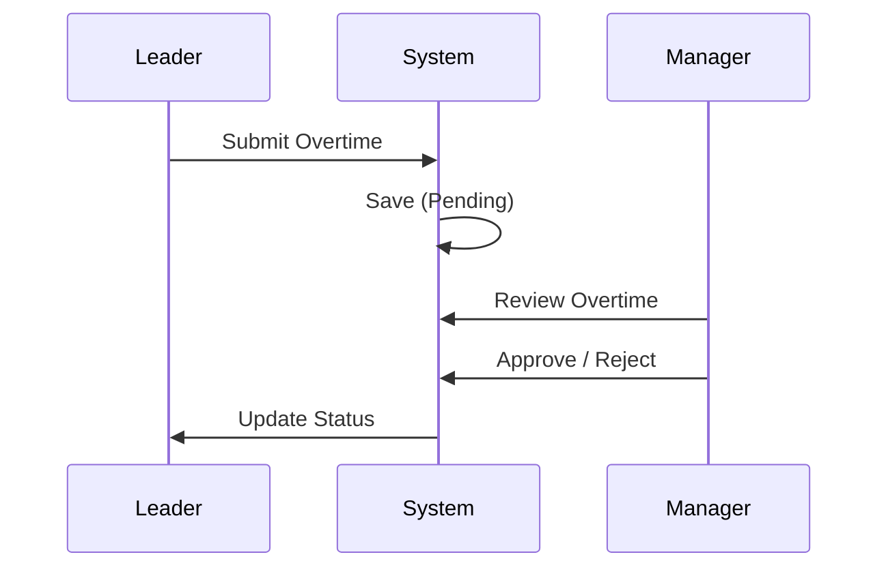

# 1️⃣ FLOWCHART SISTEM (HIGH LEVEL)

```
┌───────────┐
│   Start   │
└─────┬─────┘
      │
      ▼
┌──────────────┐
│ Login / Auth │
└─────┬────────┘
      │
      ▼
┌────────────────────┐
│ Check User Role    │
└─────┬─────┬────────┘
      │     │
      │     │
      │     │
      ▼     ▼
┌────────┐ ┌────────────┐
│  Staf  │ │   Leader   │
└──┬─────┘ └─────┬──────┘
   │               │
   │               ▼
   │        ┌──────────────┐
   │        │ Create       │
   │        │ Overtime     │
   │        │ + Attachment │
   │        └─────┬────────┘
   │              ▼
   │        ┌──────────────┐
   │        │ Status       │
   │        │ Pending      │
   │        └─────┬────────┘
   │              ▼
   │        ┌──────────────┐
   │        │ Manager      │
   │        │ Approval     │
   │        └─────┬────────┘
   │              ▼
   │        ┌──────────────┐
   │        │ Approved /   │
   │        │ Rejected     │
   │        └──────────────┘
   │
   ▼
┌──────────────┐
│ View Overtime│
│ Status       │
└──────────────┘
```

---

# 2️⃣ ACTIVITY DIAGRAM – PENGAJUAN & APPROVAL LEMBUR

### 🎯 Fokus: workflow bisnis

```
(Start)
   |
   ▼
Leader Login
   |
   ▼
Open "Create Overtime"
   |
   ▼
Fill Form
(tanggal, jam, alasan, staf)
   |
   ▼
Upload Lampiran? ── No ─┐
        │ Yes           │
        ▼               │
   Attach File           │
        │               │
        └───────┬───────┘
                ▼
         Submit Form
                |
                ▼
       Save Overtime
       Status = Pending
                |
                ▼
          Manager Login
                |
                ▼
       View Pending Overtime
                |
                ▼
      Approve or Reject?
           │        │
         Yes        No
           │        │
           ▼        ▼
   Status = Approved  Status = Rejected
           │
           ▼
        (End)
```

---

# 3️⃣ ACTIVITY DIAGRAM – REPORT LEMBUR

```
(Start)
   |
   ▼
Admin / Manager Login
   |
   ▼
Open Report Page
   |
   ▼
Apply Filter?
(from, to, status, division, search)
   │        │
   │ No     │ Yes
   │        ▼
   │   Apply Filter Query
   │        |
   └────────┴─────────┐
                      ▼
        Aggregate Data (SUM jam)
                      |
                      ▼
           Display Report Table
                      |
                      ▼
                 Reset Filter?
                  │        │
                Yes        No
                  │        │
                  ▼        ▼
           Reload Page     (End)
```

---

# 4️⃣ BONUS – MERMAID DIAGRAM (README READY 🔥)

Kalau README kamu support Mermaid (GitHub / GitLab / Obsidian):

### 🔹 Flowchart Overtime



---

### 🔹 Activity Diagram Approval

